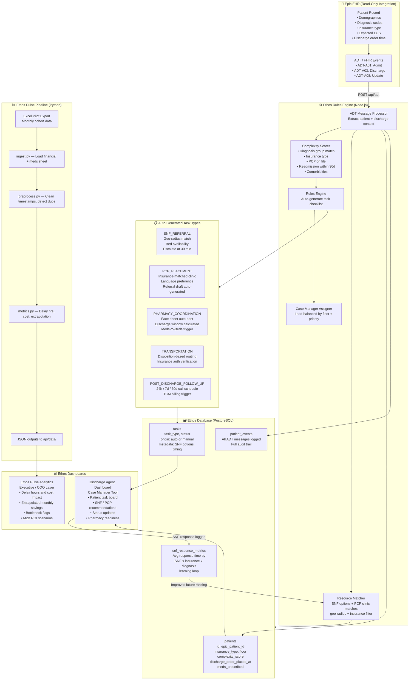
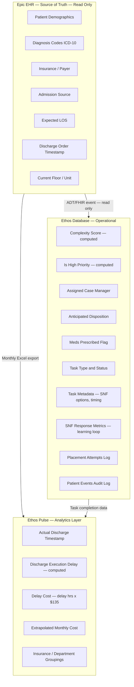

# Ethos Platform — Architecture & Flow Documentation

> **Audience**: COO, Case Managers, Engineering Team (Mohammed)
> **Program**: Meds-to-Beds (M2B) at Saint John's Regional Medical Center
> **Version**: March 2026 — Pilot Phase

---

## Context

The **Ethos platform** addresses a single, measurable problem: **nonmedical discharge delays** that waste bed capacity and inflate costs.

| Metric | Value |
|--------|-------|
| Total monthly discharges | **800** |
| Currently in M2B program | **80 (10%)** |
| Average nonmedical delay | **4.4 hours/patient** |
| Cost per delay hour (CA) | **$135** |
| Monthly waste (80 patients) | **$48,000** |
| Annual waste (extrapolated) | **$600,000+** |
| Patients lacking PCP | **80%** |
| SNF placement avg wait | **28 hours** |
| Pharmacy visibility gap | **45–90 min** |

**Month 1 result**: Delay reduced from **4.4h → 3.0h** (1.5h improvement per patient)

---

## Diagram 1 — System / Agentic Architecture

> For: Mohammed (API planning) + Engineering team

---

## Diagram 2 — Clinical Patient Journey (M2B Flow)

> For: COO + Case Managers — shows where Ethos adds value at every step

```mermaid
flowchart LR
    subgraph ADMIT["Day 0: Admission"]
        A1["Patient Arrives\nED or Scheduled"]
        A2["Epic ADT-A01 Fired"]
        A3["Ethos: Patient created\nChecklist built\nCase manager assigned"]
        A1 --> A2 --> A3
    end

    subgraph STAY["Days 1-N: Inpatient Stay"]
        S1["Case Manager Reviews\nEthos Task Board"]
        S2["SNF_REFERRAL auto-created\nTop 3 facilities ranked\nReferral sent automatically\n30-min escalation if no response"]
        S3["PCP_PLACEMENT auto-created\nInsurance-matched clinics\nLanguage preference matched"]
        S1 --> S2
        S1 --> S3
    end

    subgraph DISCHARGE_ORDER["Discharge Day: Order Placed"]
        D1["Doctor Signs Discharge Order\nHistorically 12 PM"]
        D2["Epic ADT update — Ethos notified"]
        D3["PHARMACY_COORDINATION triggered\nFace sheet auto-sent to pharmacy\nNo more 45-90 min fax gap\nDischarge window calculated"]
        D4["TRANSPORTATION task created\nInsurance auth checked\nMode arranged"]
        D1 --> D2 --> D3 & D4
    end

    subgraph MEDS_TO_BEDS["Meds-to-Beds Execution"]
        M1["Pharmacy Receives Auto-Notification"]
        M2["Medications Prepared\nwithin discharge window"]
        M3["Meds Delivered to Bedside\nbefore patient leaves"]
        M4["Task marked complete"]
        M1 --> M2 --> M3 --> M4
    end

    subgraph ACTUAL_DISCHARGE["Actual Discharge"]
        X1["All Tasks Green\nTransport ready\nMeds delivered\nSNF confirmed or PCP scheduled"]
        X2["Patient Discharged\nTarget: under 2hr after order"]
        X1 --> X2
    end

    subgraph FOLLOWUP["Post-Discharge — Ethos Owned"]
        F1["Follow-up auto-scheduled"]
        F2["24-hr check-in call"]
        F3["7-day check-in call"]
        F4["30-day readmission prevention"]
        F5["TCM Billing Triggered\n$1,400+ per eligible patient"]
        F1 --> F2 --> F3 --> F4
        F3 --> F5
    end

    ADMIT --> STAY --> DISCHARGE_ORDER --> MEDS_TO_BEDS --> ACTUAL_DISCHARGE --> FOLLOWUP
```

---

## Diagram 3 — Information Architecture

> For: Mohammed — where does each piece of data live?

---

## Data Ownership Table

| Data Field | Lives In | Updated By | Used For |
|-----------|----------|-----------|---------|
| Patient demographics | Epic (primary) | Hospital staff | Patient identification |
| Diagnosis codes | Epic (primary) | Physicians | Task generation, SNF matching |
| Insurance type | Epic (primary) | Admissions | SNF + PCP filtering |
| Discharge order time | Epic (primary) | Attending MD | Delay calculation |
| Complexity score | Ethos DB | Rules engine (auto) | Priority routing |
| Task list | Ethos DB | Rules engine (auto) | Case manager workflow |
| SNF referral outcome | Ethos DB | Case manager | Learning loop |
| Avg SNF response time | Ethos DB | Learning loop | Future ranking |
| Actual discharge time | Excel export (pilot) | Hospital system | Delay cost calculation |
| Delay hours | Ethos Pulse (computed) | Pipeline | ROI reporting |

---

## The Five Automation Targets

| # | Target | Current State | Ethos Solution | Status |
|---|--------|--------------|---------------|--------|
| 1 | **SNF Bed Confirmation** | Manual calls, avg 28hr wait | Geo-radius match + auto referral + 30-min escalation | ✅ Prototype |
| 2 | **Disposition ID from EHR** | Case manager reads notes | Auto-detect from diagnosis codes | ✅ Prototype |
| 3 | **Transportation** | Manual phone calls | Task auto-created post-discharge-order | 🟡 Scaffolded |
| 4 | **Post-Discharge Follow-up** | Ad-hoc, inconsistent | 24/7/30-day call schedule, TCM billing trigger | 🟡 Scaffolded |
| 5 | **Medication Delivery Tracking** | 45–90min fax gap | Face sheet auto-sent on discharge order event | ✅ Prototype |

---

## Bottleneck → Automation Map

| Bottleneck | Ethos Solution |
|-----------|---------------|
| Manual nurse input (inconsistent) | Standardized checklist built at admit |
| No ownership structure | Auto case manager assignment by floor + priority |
| SNF avg 28-hour wait | Ranked referrals + 30-min escalation loop |
| 45–90 min pharmacy fax gap | Auto face sheet sent on discharge order event |
| Doctor rounds 8AM / signs 12PM | Discharge window pre-calculated and surfaced |
| Post-discharge patient loss | Automated 24/7/30-day follow-up schedule |
| 80% patients lack PCP | PCP task auto-created, insurance-matched |
